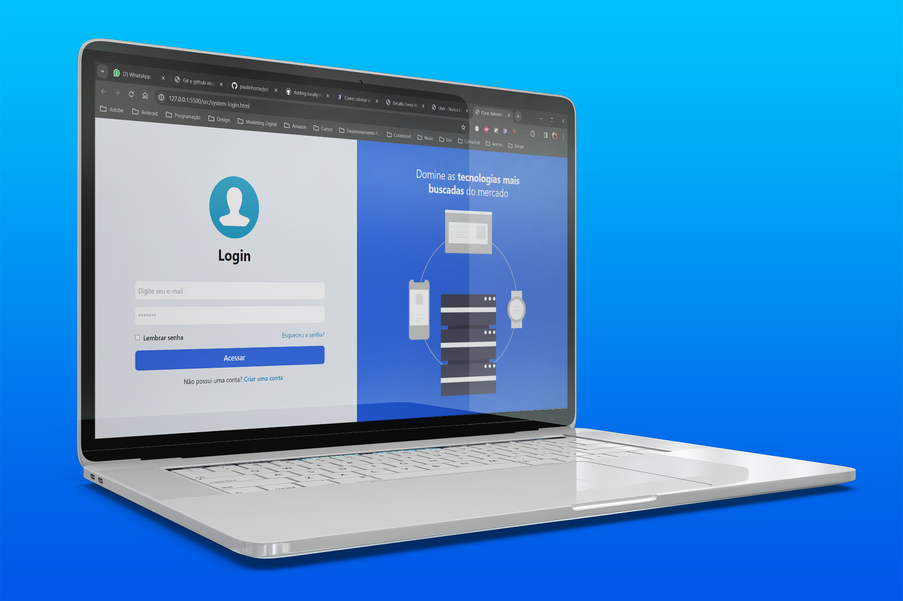

<h1 align="center">Projeto - Tela login</h1>

# Sobre

Primeiro projeto desenvolvido no curso de Tailwindcss.

# Linguagens

<h4>Linguagens / Tecnologias utilizadas:</h4>
<ul>
    <li>HTML</li>
    <li>CSS</li>
    
</ul>

Nesta primeira parte, foi possível aprender os primeiros passos com o Tailwind, criar componentes, usar o display Flex e Grid e outras classes utilitárias da biblioteca.

<h3 align="center">Visualização Desktop</h3>

<h3 align="center">Visualização Mobile</h3>

